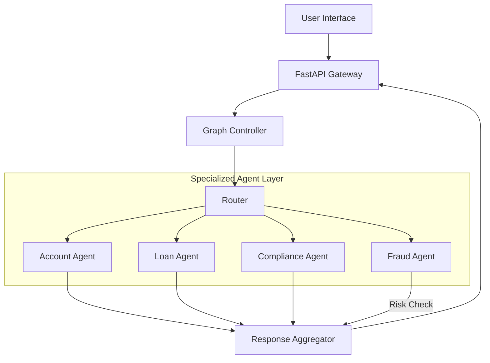
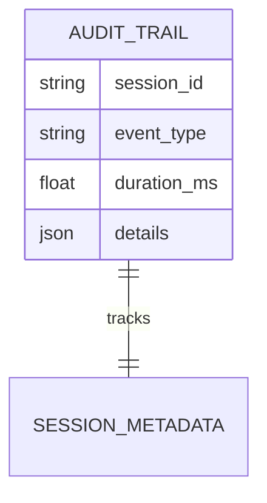

# Architecture Report: Intelligent Banking Assistant

## 1. Executive Summary
The Intelligent Banking Assistant is a next-generation specialized AI orchestration system designed to handle complex, multi-domain financial queries with high reliability and observability. By leveraging a modular agentic architecture, the system decomposes user intent into specialized workflows handled by autonomous "agents" (Account, Loan, Fraud, Compliance). This report details the technical architecture, data strategy (centered around high-fidelity synthetic data), and the robust observability framework that ensures institutional-grade performance monitoring.

## 2. Introduction
### 2.1 Purpose and Scope
This report serves as the primary technical documentation for the Intelligent Banking Assistant's architecture. It is designed for stakeholders requiring a deep dive into the system's modularity, integration patterns, and operational standards. The scope covers the entire request lifecycle, from API ingestion to final response aggregation.

### 2.2 Problem Statement
Traditional banking interfaces often struggle with cross-functional queries (e.g., "How does my recent large deposit affect my eligibility for the loan I applied for?"). Such queries require coordination between core banking, credit underwriting, and fraud detection systems. The Intelligent Banking Assistant solves this by providing a unified interface powered by dynamic graph-based orchestration.

## 3. System Architecture

The system utilizes a directed acyclic graph (DAG) based orchestration model, implemented using state-of-the-art graph-native frameworks. This allows for conditional logic, parallel execution of agents, and safe human-in-the-loop interruptions for high-risk scenarios.

### 3.1 Orchestration Logic
The request lifecycle is managed by a central **Router** node which classifies user intent. Based on this classification, the state is transitioned to specialized agent nodes. Each node is a self-contained logic unit that interacts with external services via standardized protocols.

#### High-Level Component Diagram
Refer to `docs/diagrams/system_architecture.mermaid` for the visual representation.

### 3.2 specialized Agent Nodes
- **Account Agent**: Handles core banking inquiries such as balances, transaction history, and account status.
- **Loan Agent**: Manages inquiries regarding loan products, application status, and personalized eligibility checks.
- **Fraud Agent**: Monitors incoming queries for anomalous behavior and triggers escalation flows when necessary.
- **Compliance Agent**: Ensures all generated responses adhere to regulatory standards and internal banking policies.

## 4. Model Context Protocol (MCP) and Tooling
To maintain a high degree of modularity and vendor neutrality, the system interacts with backend services (Core Banking, Credit, Fraud, Compliance) through the **Model Context Protocol (MCP)**.

### 4.1 MCP Servers
Each banking domain is represented by a dedicated MCP server. This decoupling allows individual backend modules to be upgraded, replaced, or scaled independently without affecting the central orchestration logic.
- **Port 8001**: Core Banking Services
- **Port 8002**: Credit & Underwriting
- **Port 8003**: Fraud Detection
- **Port 8004**: Regulatory Compliance

### 4.2 Knowledge Integration
The system integrates a **ChromaDB-backed Vector Store** for retrieval-augmented generation (RAG) and a **Knowledge Graph** to maintain structural relationships between banking entities and policies. This dual-layer knowledge approach ensures that agents have access to both unstructured document data and structured relational data.

## 5. Data Strategy: Synthetic Data Excellence
A core pillar of the Intelligent Banking Assistant is its reliance on high-fidelity **synthetic financial data**.

### 5.1 Rationale for Synthetic Data
In financial services, the use of Personal Identifiable Information (PII) for development and performance benchmarking is restricted by regulations such as GDPR and CCPA. To bypass these constraints while maintaining realistic system behavior, we utilize synthetic datasets generated to mirror the statistical distributions of real-world banking transactions and customer profiles.

### 5.2 Synthetic Data Characteristics
- **Transaction Consistency**: Synthetic transaction histories follow realistic temporal patterns (e.g., salary deposits, monthly recurring payments).
- **Edge Case Simulation**: Synthetic data allows us to intentionally inject "fraudulent-like" behavior and "non-compliant" patterns to verify the robustness of our safety agents.
- **Idempotent Ingestion**: Our document loaders ensure that the vector store is seeded with consistent synthetic regulatory documents, allowing for reproducible RAG results across different environments.

## 6. Observability and Performance Monitoring
Financial institutions require granular visibility into AI decision-making processes. Our observability framework is built into the core decorators of the system.

### 6.1 Timing Decorators
We employ centralized Python decorators—`@time_node` and `@time_tool`—to wrap every critical function. These decorators automatically capture:
- **Node Latency**: Execution time for each agent node in the LangGraph.
- **Tool Latency**: Rountrip time for external MCP calls, Knowledge Graph queries, and Vector Store retrievals.

### 6.2 Metrics and SQLite Audit Store
All timing data and request/response payloads are persisted in a **SQLite Audit Store**. This store is optimized with indexes on `session_id` and `timestamp` to facilitate high-speed retrieval of session history.

#### Database Schema (Simplified)
Refer to `docs/diagrams/er_diagram.mermaid` for the full ER model.

### 6.3 KPI: P50 and P90 Latencies
The system exposes a `/metrics` endpoint that aggregates real-time latencies into P50 (median) and P90 (tail latency) values. This allows operations teams to identify bottlenecks in specific agents or external MCP tools immediately.

## 7. Security and Vendor Neutrality
### 7.1 Vendor Neutrality
The architecture is designed to be **LLM-Agnostic**. By utilizing standardized interfaces (LangChain/LangGraph) and the MCP protocol, the underlying Large Language Model can be swapped (e.g., between different cloud providers or local models) with minimal configuration changes. The system relies on standard environment variables for API configuration, ensuring cloud-native portability.

### 7.2 Safety Mechanisms
- **Stateful Guardrails**: The GraphState includes mandatory flags for `risk_level` and `requires_human`.
- **Human-in-the-Loop (HITL)**: When the Fraud or Compliance agents detect high-risk anomalies, the graph enters a "suspended" state, requiring manual intervention before proceeding through the `human_interrupt` node.

## 8. Development and Deployment
### 8.1 Modular Deployment
The use of multiple MCP servers on distinct ports facilitates a microservices-based deployment strategy. Each server can be containerized and orchestrated via Kubernetes, allowing independent scaling based on domain-specific load (e.g., scaling the Account MCP during peak banking hours).

### 8.2 Reproducibility
The inclusion of a `scripts/` directory with seed scripts ensures that new environments can be initialized with the complete synthetic data suite and database schemas in seconds.

## 9. Conclusion
The Intelligent Banking Assistant represents a robust, observable, and highly modular approach to AI in financial services. By prioritizing modular orchestration, synthetic data for testing, and granular latency metrics, the system provides a clear pathway for safe and performant AI deployment in regulated industries.

## 10. Appendix
- **System Architecture Diagram**: [docs/diagrams/system_architecture.mermaid](file:///home/labuser/Intelligent%20Banking%20Assistant/fincore-intelligent-banking-assistant/docs/diagrams/system_architecture.mermaid)
- **ER Diagram**: [docs/diagrams/er_diagram.mermaid](file:///home/labuser/Intelligent%20Banking%20Assistant/fincore-intelligent-banking-assistant/docs/diagrams/er_diagram.mermaid)
- **API Documentation**: Refer to `/docs` or `/redoc` on the running FastAPI server.
